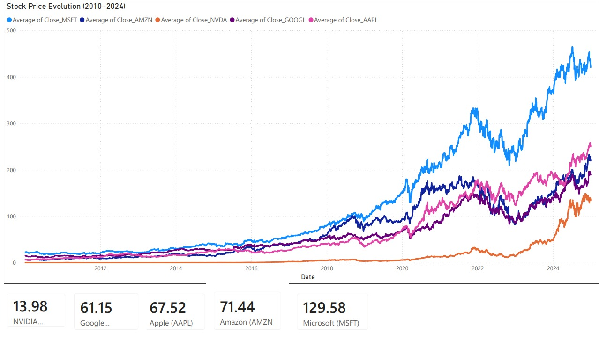
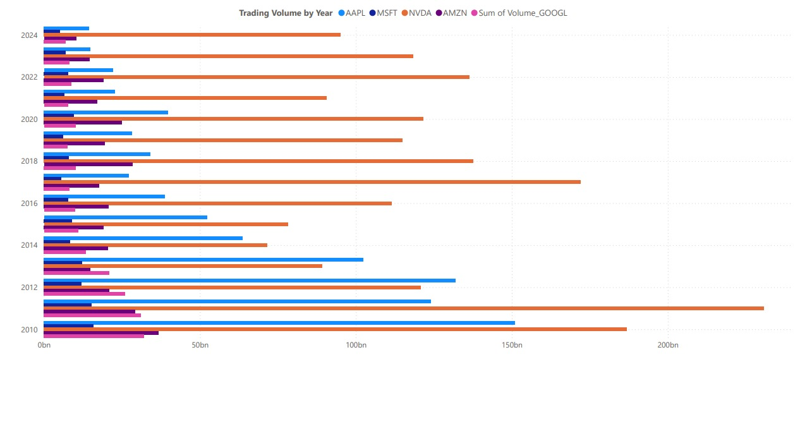
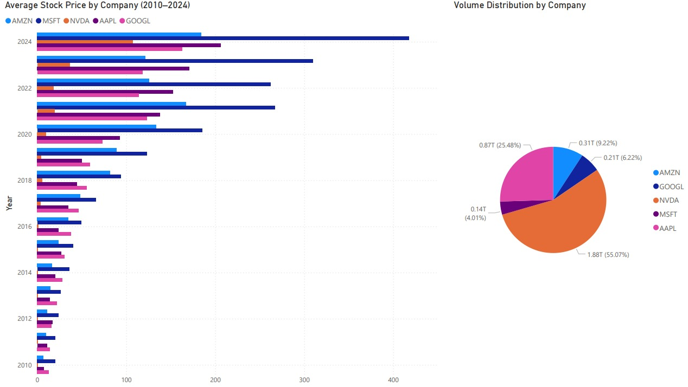
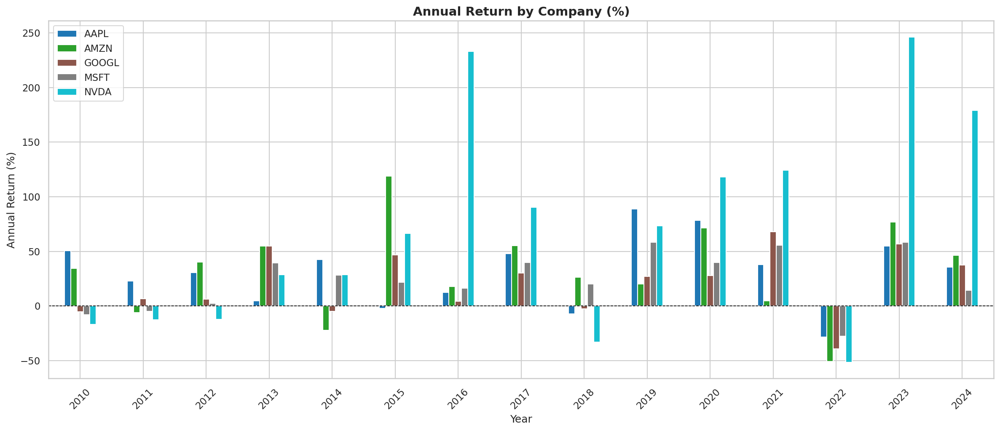
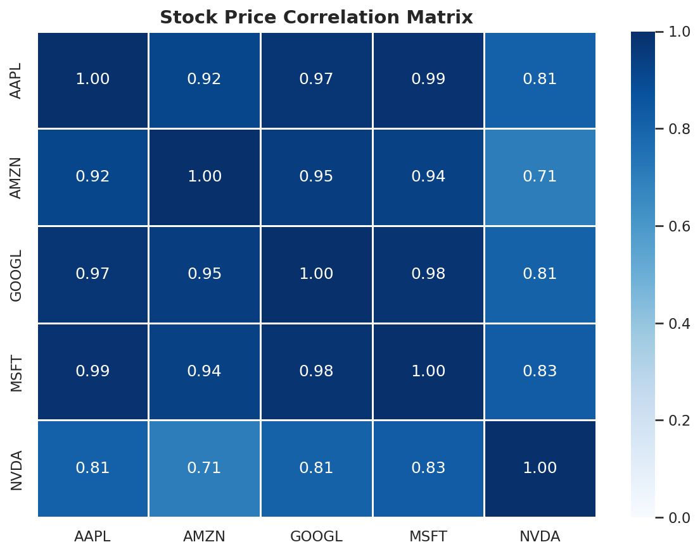

# Big Tech Stock Analysis (2010–2024)

## Project Overview

This project combines a **Power BI dashboard** and a **Python exploratory analysis** to study 15 years of stock price data for the 5 biggest tech companies: Apple, Amazon, Google, Microsoft, and NVIDIA.

The goal is to uncover long-term performance trends, annual returns, correlations between companies, and the impact of major market events.

---

## Dataset

- **Source:** [Kaggle — 15 Years Stock Data of NVDA AAPL MSFT GOOGL and AMZN](https://www.kaggle.com/datasets/marianadeem755/stock-market-data)
- **Period:** January 2010 – December 2024
- **Companies:** AAPL · AMZN · GOOGL · MSFT · NVDA
- **Records:** 3,774 trading days

---

## Key Findings

| Company | Price 2010 | Price 2024 | Total Return | Best Year | Worst Year |
|---|---|---|---|---|---|
| AAPL | $6.44 | $250.14 | **+3,784%** | 2019 (+89%) | 2022 (-28%) |
| AMZN | $6.70 | $219.39 | **+3,177%** | 2015 (+119%) | 2022 (-51%) |
| GOOGL | $15.61 | $189.08 | **+1,111%** | 2021 (+68%) | 2022 (-39%) |
| MSFT | $23.25 | $420.66 | **+1,709%** | 2023 (+58%) | 2022 (-28%) |
| NVDA | $0.42 | $134.28 | **+31,578%** | 2023 (+246%) | 2022 (-51%) |

### Notable Insights

- **NVIDIA** is the standout performer with a staggering **+31,578% return** over 14 years, driven by the AI boom in 2023 (+246% in a single year)
- **2022 was the worst year for all 5 companies** — reflecting rising interest rates and post-pandemic correction
- **2023 was the recovery year** — MSFT (+58%) and NVDA (+246%) led the rebound
- **Apple** has the most consistent long-term growth with no extreme volatility
- All 5 companies show **high price correlation** — they tend to move together with the broader market

---

## Tools & Skills


---

## Dashboard (Power BI)




---

## Python Analysis

### Annual Returns by Company


### Stock Price Correlation Matrix



---

## Repository Structure

```
📁 big-tech-stock-analysis
├── 📄 README.md
├── 📓 big_tech_stock_analysis.ipynb
├── 📊 annual_returns.png
├── 📊 correlation_matrix.png
├── 📊 dashboard_page1.png
├── 📊 dashboard_page2.png
└── 📊 dashboard_page3.png
```

---

## How to Run

1. Clone this repository
2. Download the dataset from [Kaggle](https://www.kaggle.com/datasets/marianadeem755/stock-market-data)
3. Open `big_tech_stock_analysis.ipynb` in Google Colab
4. Upload the CSV when prompted and run all cells

---

## Academic Context

This project is part of a self-directed data analytics portfolio developed alongside an **MSc in Information Management (Digital Transformation)** at NOVA IMS, Lisbon.

**Author:** Marius Faur · [LinkedIn](https://linkedin.com/in/mariusfaur) · [GitHub](https://github.com/mariussfaur)
